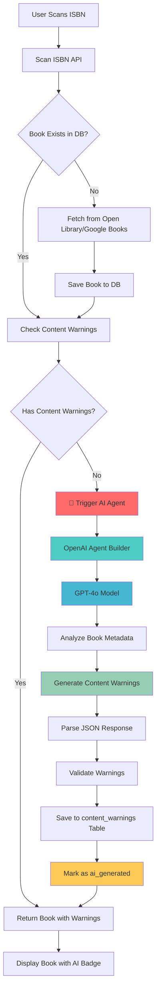
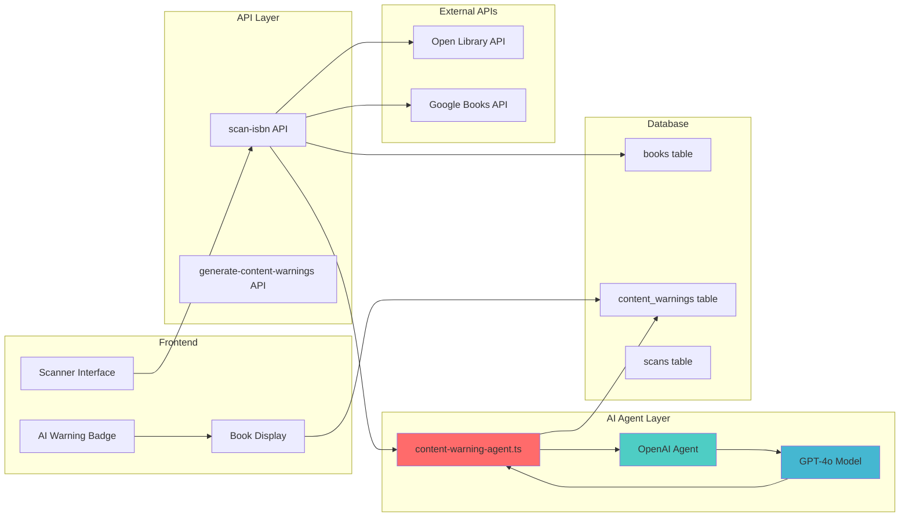
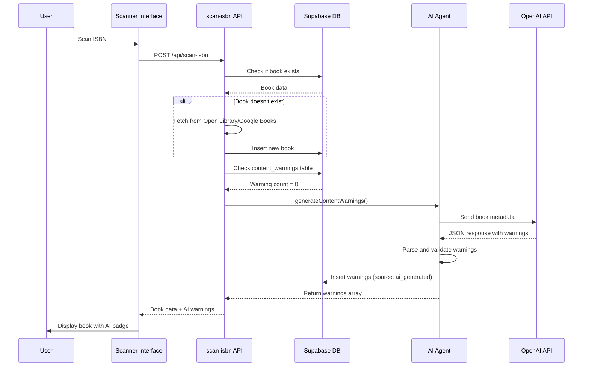
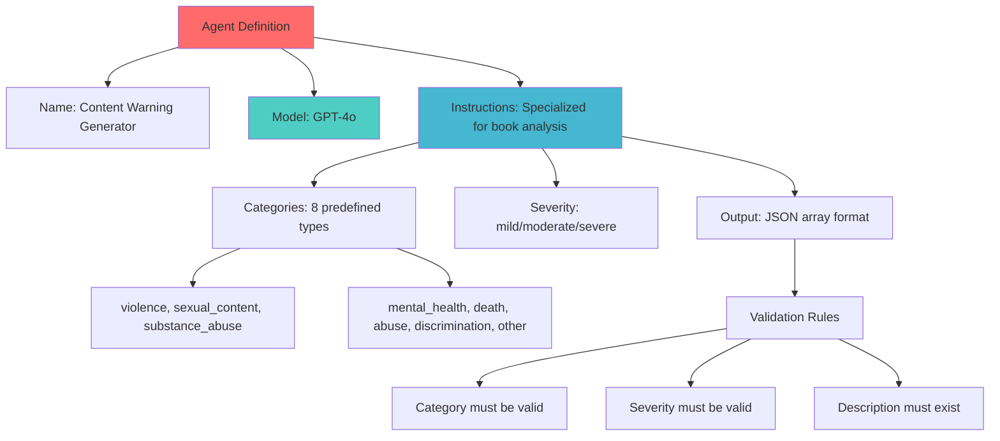
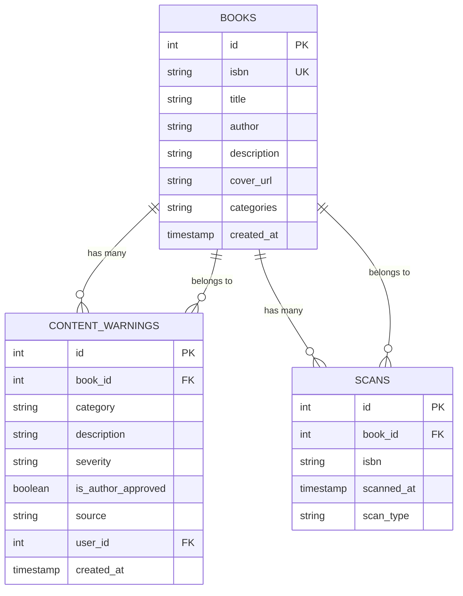

# AI Agent Architecture - Book Scanner App

## 🤖 AI Agent Integration Flow

## 🏗️ Technical Architecture

## 🔄 Data Flow Sequence

## 🎯 Agent Configuration

## 📊 Database Schema Integration

## 🚀 Key Components Used

### **1. OpenAI Agent Builder Nodes:**
- **Agent**: Main agent definition with instructions
- **Runner**: Executes the agent with conversation history
- **user()**: Helper function for user input formatting
- **GPT-4o**: The language model for content analysis

### **2. Integration Points:**
- **scan-isbn API**: Triggers agent when no warnings exist
- **content-warning-agent.ts**: Agent implementation
- **AI Warning Badge**: UI component for displaying AI-generated warnings
- **Database**: Stores generated warnings with `ai_generated` source

### **3. Data Flow:**
1. **Input**: Book metadata (title, author, description, categories)
2. **Processing**: AI analyzes and generates warnings
3. **Output**: Validated JSON array of content warnings
4. **Storage**: Saved to database with confidence and reasoning
5. **Display**: Shown to user with AI badge indicator

This architecture ensures that every scanned book gets intelligent content warnings automatically generated by the AI agent when none exist in the database!

