# AI Content Warning Agent Flow

## Overview
This document visualizes how the AI content warning agent works in the Subtext book scanning system.

## Mermaid Flowchart

```mermaid
flowchart TD
    Start([User Scans ISBN]) --> Validate[Validate ISBN Format]
    Validate -->|Invalid| Error1[Return Error: Invalid ISBN]
    Validate -->|Valid| Normalize[Normalize ISBN<br/>Remove hyphens/spaces]
    
    Normalize --> CheckDB{Check Database<br/>for Existing Book}
    
    CheckDB -->|Found| CheckStale{Is Data Stale?<br/>>30 days old}
    CheckStale -->|Yes| RefreshBG[Refresh Metadata<br/>in Background]
    CheckStale -->|No| HasWarnings{Has Content<br/>Warnings?}
    
    CheckDB -->|Not Found| FetchExternal[Fetch from External APIs<br/>Google Books → Open Library]
    
    FetchExternal --> MultipleCandidates{Multiple<br/>Candidates?}
    MultipleCandidates -->|Yes| Ambiguous[Return Ambiguous<br/>Request User Selection]
    MultipleCandidates -->|No| OneCandidate[Single Candidate Found]
    
    OneCandidate --> CheckMetadata{Metadata Quality<br/>Check}
    CheckMetadata -->|Thin Metadata<br/>desc < 150 chars<br/>or no cover| CreateMinimal[Create Minimal Book Record<br/>with ISBN only]
    CheckMetadata -->|Good Metadata| CreateFull[Create Full Book Record<br/>with Metadata]
    
    CreateMinimal --> AIWebSearch1[AI Agent: findBookAndGenerateWarnings<br/>Web Search + AI Analysis]
    CreateFull --> CheckWarnings1{Has Warnings?}
    
    AIWebSearch1 --> WebSearchParallel[Parallel Web Searches:<br/>1. Google Books API<br/>2. Apple Books API<br/>3. DuckDuckGo<br/>4. Author Site Search<br/>5. Direct Author Scraping]
    
    WebSearchParallel --> AIAnalyze1[AI Analyzes Results<br/>Instruction Mode: hybrid]
    AIAnalyze1 --> UpdateBook1[Update Book Record<br/>with AI-found Metadata]
    UpdateBook1 --> SaveWarnings1[Save Content Warnings<br/>to Database]
    
    RefreshBG --> HasWarnings
    HasWarnings -->|Yes| CheckStaleWarnings{Are Warnings<br/>Stale?<br/>Old Model/Taxonomy}
    HasWarnings -->|No| GenerateWarnings[Generate Content Warnings]
    
    CheckStaleWarnings -->|Yes| DeleteOld[Delete Old Warnings]
    CheckStaleWarnings -->|No| UseExisting[Use Existing Warnings]
    DeleteOld --> GenerateWarnings
    
    CheckWarnings1 -->|No| GenerateWarnings
    CheckWarnings1 -->|Yes| UseExisting
    
    GenerateWarnings --> Strategy{Choose Strategy}
    
    Strategy -->|Existing Book OR<br/>Thin Metadata OR<br/>Force Refresh| WebSearchPath[AI Web Search Path]
    Strategy -->|New Book with<br/>Good Metadata| MetadataPath[Metadata-Only Path]
    
    WebSearchPath --> CachedResult{Cached Web<br/>Search Result?}
    CachedResult -->|Yes| UseCached[Use Cached Result]
    CachedResult -->|No| AIWebSearch2[AI Agent: findBookAndGenerateWarnings<br/>Web Search + AI Analysis]
    
    AIWebSearch2 --> WebSearchParallel2[Parallel Web Searches:<br/>Google Books, Apple Books,<br/>DuckDuckGo, Author Sites]
    WebSearchParallel2 --> AIAnalyze2[AI Analyzes with Hybrid Mode]
    
    MetadataPath --> AIMetadata[AI Agent: generateContentWarnings<br/>Metadata-Based Analysis]
    AIMetadata --> CheckNoWarnings{No Warnings<br/>Found?}
    CheckNoWarnings -->|Yes| VerifySearch[Deep Web Search Verification<br/>Avoid False Negatives]
    CheckNoWarnings -->|No| SaveWarnings2[Save Warnings]
    
    VerifySearch --> AIWebSearch3[AI Agent: findBookAndGenerateWarnings<br/>Verification Search]
    AIWebSearch3 --> FoundWarnings{Found Hidden<br/>Warnings?}
    FoundWarnings -->|Yes| OverrideResult[Override with<br/>Web Search Results]
    FoundWarnings -->|No| ConfirmSafe[Confirm Safe Verdict<br/>with Low Confidence]
    
    UseCached --> SaveWarnings2
    AIAnalyze2 --> SaveWarnings2
    OverrideResult --> SaveWarnings2
    ConfirmSafe --> SaveWarnings2
    
    SaveWarnings1 --> RecordScan
    SaveWarnings2 --> RecordScan
    UseExisting --> RecordScan
    
    RecordScan[Record Scan in Database<br/>Award Sparks to User] --> End([Return Scan Result])
    
    %% AI Agent Internal Process
    subgraph AIAgent["AI Agent Internal Process (Hybrid Mode)"]
        direction TB
        A1[Receive Book Metadata] --> A2{Instruction Mode?}
        A2 -->|old| OldMode[Assumption-Based<br/>Uses Genre Conventions]
        A2 -->|new| NewMode[Evidence-Based<br/>Strict, No Assumptions]
        A2 -->|hybrid| HybridMode[Hybrid Mode<br/>Evidence First, Then Inference]
        
        HybridMode --> Phase1[Phase 1: Evidence-Based Analysis<br/>1. Author/Publisher Authority<br/>2. Professional Reviews<br/>3. User Consensus]
        Phase1 --> Phase2[Phase 2: Inference-Based Analysis<br/>Only if Evidence Insufficient<br/>Genre-Aware Conservative Inference]
        Phase2 --> Phase3[Phase 3: False Positive Checks<br/>Death ≠ Grief<br/>Action ≠ Violence<br/>Non-Fiction = Clinical]
        
        Phase3 --> Taxonomy[Apply Hierarchical Taxonomy<br/>Category + Subcategory<br/>Presence + Detail Level]
        Taxonomy --> Scoring[Calculate Severity Score<br/>0.0-1.0 ACB-Aligned]
        Scoring --> Classification[Assign Classification Rating<br/>G/PG/M/MA15+/R18+]
        Classification --> Output[Return Warnings Array<br/>with Reasoning]
        
        OldMode --> Taxonomy
        NewMode --> Taxonomy
    end
    
    %% Web Search Tool Details
    subgraph WebSearch["Web Search Tool (Parallel Execution)"]
        direction TB
        WS1[Google Books API<br/>ISBN or Title Search] --> WS2[Apple Books API<br/>ISBN or Title Search]
        WS2 --> WS3[DuckDuckGo Search<br/>General Information]
        WS3 --> WS4[Author Site Search<br/>Official Content Warnings]
        WS4 --> WS5[Direct Author Scraping<br/>Known Author Domains]
        WS5 --> WS6[Combine All Results<br/>Return to AI Agent]
    end
    
    %% Styling
    classDef aiProcess fill:#e1f5ff,stroke:#0066cc,stroke-width:2px
    classDef webSearch fill:#fff4e1,stroke:#cc6600,stroke-width:2px
    classDef decision fill:#ffe1f5,stroke:#cc0066,stroke-width:2px
    classDef database fill:#e1ffe1,stroke:#00cc66,stroke-width:2px
    
    class AIWebSearch1,AIWebSearch2,AIWebSearch3,AIAnalyze1,AIAnalyze2,AIMetadata,HybridMode,OldMode,NewMode aiProcess
    class WebSearchParallel,WebSearchParallel2,WS1,WS2,WS3,WS4,WS5,WS6 webSearch
    class CheckDB,CheckStale,HasWarnings,MultipleCandidates,CheckMetadata,CheckWarnings1,Strategy,CachedResult,CheckNoWarnings,FoundWarnings,A2 decision
    class CheckDB,CreateMinimal,CreateFull,UpdateBook1,SaveWarnings1,SaveWarnings2,RecordScan,UseExisting database
```

## Key Decision Points

### 1. Database Lookup
- **Found**: Check if data is stale (>30 days), refresh in background if needed
- **Not Found**: Fetch from external APIs (Google Books → Open Library)

### 2. Metadata Quality
- **Thin Metadata**: Description < 150 chars OR no cover → Trigger AI web search immediately
- **Good Metadata**: Create full book record, proceed to warning generation

### 3. Warning Generation Strategy
- **Existing Book OR Thin Metadata OR Force Refresh**: Use web search path (more thorough, finds official content notes)
- **New Book with Good Metadata**: Use metadata-only path first (faster), then verify with web search if no warnings found

### 4. AI Instruction Modes
- **Old**: Assumption-based, uses genre conventions
- **New**: Evidence-based, strict, no assumptions
- **Hybrid** (Default): Evidence-first, then conservative inference

## AI Agent Hybrid Mode Process

1. **Phase 1: Evidence-Based Analysis**
   - Source Priority: Author/Publisher > Professional Reviews > User Consensus
   - Conflict Resolution: If author says "clean" but >70% users cite trigger, flag as Verified (User Consensus)

2. **Phase 2: Inference-Based Analysis** (Only if evidence insufficient)
   - Romance: Don't infer explicit sex unless "Steamy", "Spice", or "Erotica" indicated
   - Thriller/Mystery: Don't infer graphic gore unless "Horror", "Slasher", or "Dark" indicated
   - Lower confidence (0.5-0.69) for inferred warnings

3. **Phase 3: False Positive Checks**
   - Death ≠ Grief (unless processing of loss is theme)
   - Action ≠ Violence (unless gore described)
   - Non-Fiction = Clinical detail level

4. **Taxonomy Application**
   - Hierarchical structure: Category + Subcategory
   - Context fields: Presence (on_page/off_page/flashback/referenced/implied)
   - Detail level: graphic/moderate/vague/clinical
   - Spoiler flag: Whether warning reveals plot twists

5. **Scoring & Classification**
   - Severity score: 0.0-1.0 (ACB-aligned)
   - Classification rating: G/PG/M/MA15+/R18+ based on highest severity

## Web Search Sources (Parallel Execution)

1. **Google Books API**: ISBN or title search, returns metadata and covers
2. **Apple Books API**: ISBN or title search, returns metadata
3. **DuckDuckGo**: General information search
4. **Author Site Search**: Official content warnings from author websites
5. **Direct Author Scraping**: Known author domains (e.g., hannahgrace.co.uk)

All searches execute in parallel for performance.

## Performance Optimizations

- **Caching**: Web search results cached to avoid duplicate searches
- **Parallel Execution**: All web searches run simultaneously
- **Background Refresh**: Stale data refreshed in background (non-blocking)
- **Cover Validation**: Placeholder images rejected before saving
- **Staleness Detection**: Warnings regenerated if model/taxonomy version outdated

## Error Handling

- **API Key Missing**: Returns error with configuration instructions
- **Rate Limits**: Handles 429 errors gracefully
- **Quota Exceeded**: Returns error with billing information
- **Book Not Found**: Returns low confidence result with reasoning
- **Web Search Failure**: Falls back to metadata-only analysis

