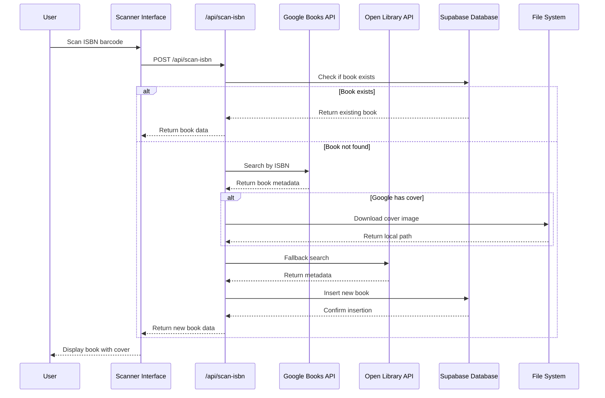
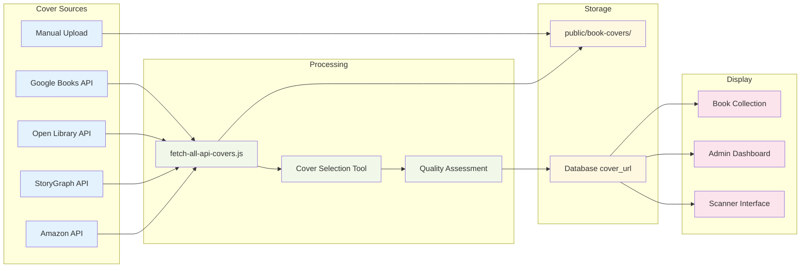
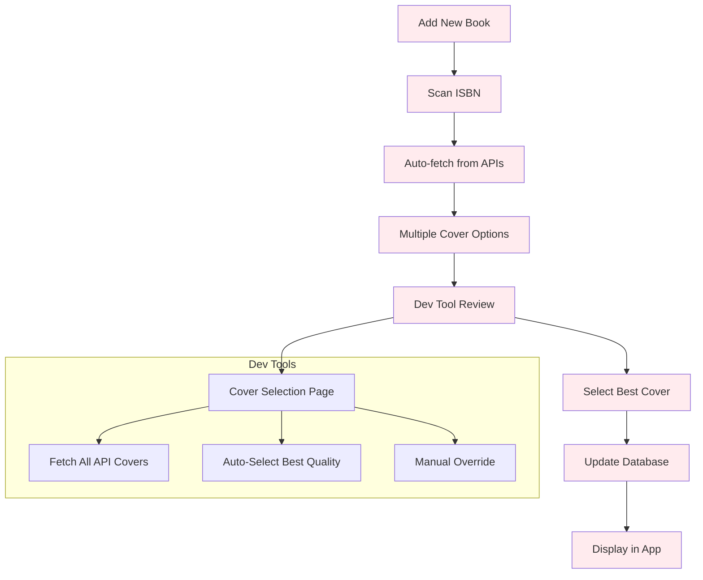
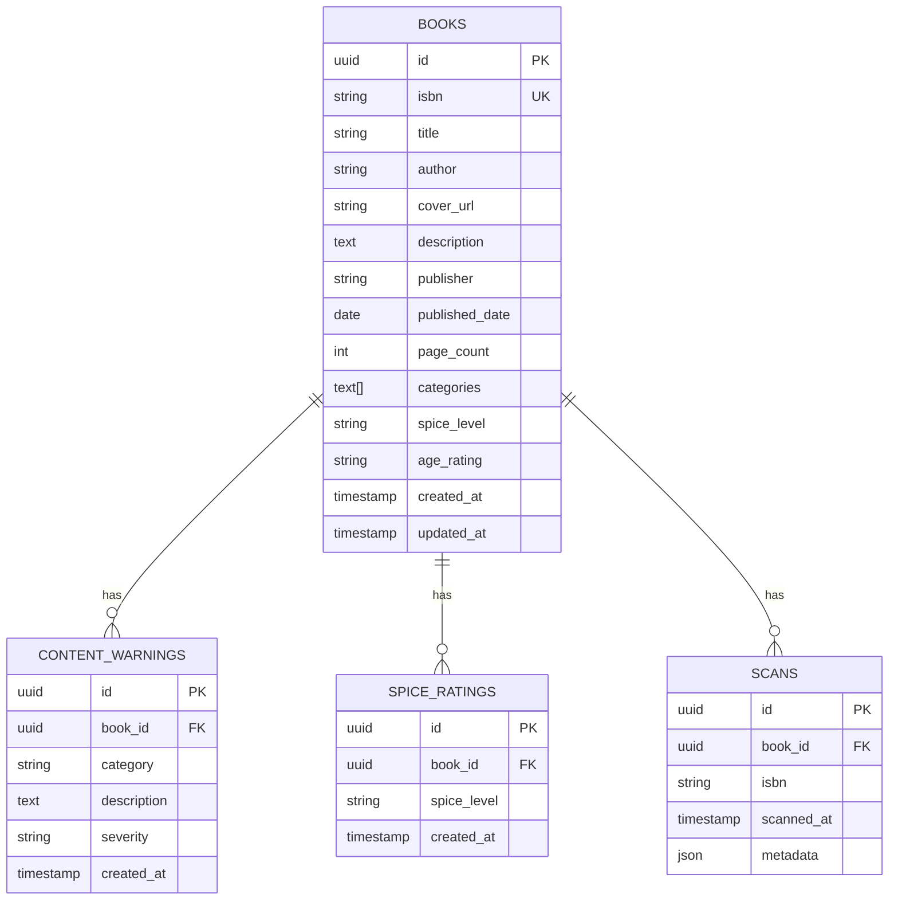

# Book Scanner App Architecture

## System Overview

```mermaid
graph TB
    %% User Interface Layer
    subgraph "Frontend (Next.js)"
        UI[Scanner Interface]
        Admin[Admin Dashboard]
        Collection[Book Collection]
        DevTool[Cover Selection Tool - DEV ONLY]
    end

    %% API Layer
    subgraph "API Routes"
        ScanAPI[/api/scan-isbn]
        AdminAPI[/api/admin/*]
        CoverAPI[/api/update-covers]
        FetchAPI[/api/fetch-all-covers - DEV]
        ClearAPI[/api/clear-books - DEV]
        RestoreAPI[/api/restore-sample-books - DEV]
    end

    %% External APIs
    subgraph "External APIs"
        GoogleBooks[Google Books API]
        OpenLibrary[Open Library API]
        StoryGraph[StoryGraph API - Future]
        Amazon[Amazon API - Future]
    end

    %% Database
    subgraph "Database (Supabase)"
        BooksTable[(Books Table)]
        WarningsTable[(Content Warnings)]
        SpiceTable[(Spice Ratings)]
        ScansTable[(Scans Table)]
    end

    %% File System
    subgraph "File Storage"
        CoverFiles[public/book-covers/]
        Scripts[scripts/]
    end

    %% Dev Tools
    subgraph "Development Tools"
        FetchScript[fetch-all-api-covers.js]
        BetterScript[fetch-better-covers.js]
        CorrectScript[fetch-correct-covers.js]
    end

    %% User Interactions
    UI --> ScanAPI
    Admin --> AdminAPI
    Collection --> AdminAPI
    DevTool --> CoverAPI
    DevTool --> FetchAPI

    %% API to External Services
    ScanAPI --> GoogleBooks
    ScanAPI --> OpenLibrary
    FetchAPI --> GoogleBooks
    FetchAPI --> OpenLibrary
    FetchAPI --> StoryGraph
    FetchAPI --> Amazon

    %% API to Database
    ScanAPI --> BooksTable
    AdminAPI --> BooksTable
    AdminAPI --> WarningsTable
    AdminAPI --> SpiceTable
    AdminAPI --> ScansTable
    CoverAPI --> BooksTable
    ClearAPI --> BooksTable
    RestoreAPI --> BooksTable

    %% Scripts to External APIs
    FetchScript --> GoogleBooks
    FetchScript --> OpenLibrary
    BetterScript --> OpenLibrary
    CorrectScript --> GoogleBooks

    %% File Operations
    FetchAPI --> FetchScript
    FetchScript --> CoverFiles
    BetterScript --> CoverFiles
    CorrectScript --> CoverFiles
    CoverAPI --> CoverFiles

    %% Database Relationships
    BooksTable --> WarningsTable
    BooksTable --> SpiceTable
    BooksTable --> ScansTable

    %% Styling
    classDef frontend fill:#e1f5fe
    classDef api fill:#f3e5f5
    classDef external fill:#fff3e0
    classDef database fill:#e8f5e8
    classDef files fill:#fce4ec
    classDef dev fill:#ffebee

    class UI,Admin,Collection,DevTool frontend
    class ScanAPI,AdminAPI,CoverAPI,FetchAPI,ClearAPI,RestoreAPI api
    class GoogleBooks,OpenLibrary,StoryGraph,Amazon external
    class BooksTable,WarningsTable,SpiceTable,ScansTable database
    class CoverFiles,Scripts files
    class FetchScript,BetterScript,CorrectScript,DevTool,FetchAPI,ClearAPI,RestoreAPI dev
```

## Data Flow



## Cover Management System



## Development Workflow



## Database Schema



## Key Features

### Production Features
- **ISBN/Barcode Scanning** - Camera-based scanning with ZXing
- **Book Metadata Fetching** - Google Books and Open Library APIs
- **Content Warning System** - Categorized warnings with severity levels
- **Spice Rating System** - Age-appropriate content ratings
- **Admin Dashboard** - Book management and review workflow
- **Book Collection** - Browse and search books

### Development Tools (DEV ONLY)
- **Cover Selection Tool** - Visual interface for choosing covers
- **API Cover Fetching** - Comprehensive multi-API cover search
- **Database Management** - Clear and restore sample data
- **Quality Assessment** - File size and source-based quality indicators

### Security & Environment
- **Development Mode Protection** - Dev tools only work in development
- **Environment Variables** - Secure API key management
- **Row Level Security** - Supabase RLS policies
- **Input Validation** - ISBN validation and sanitization
