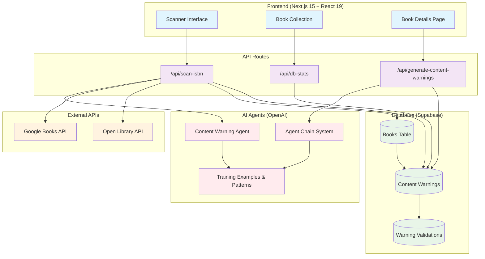
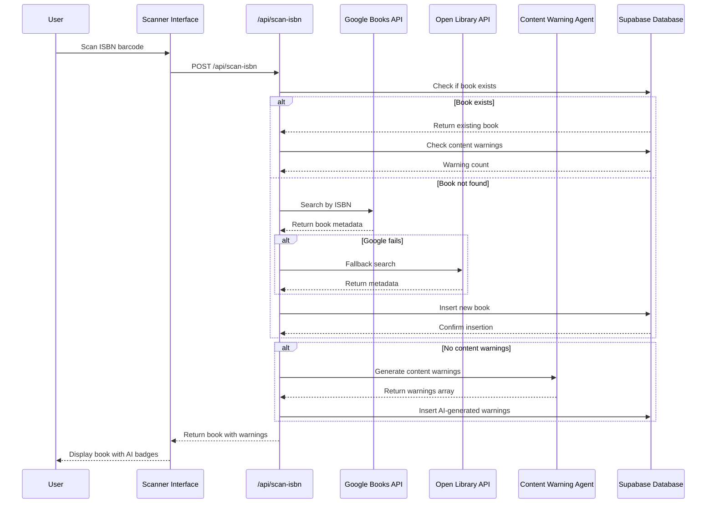
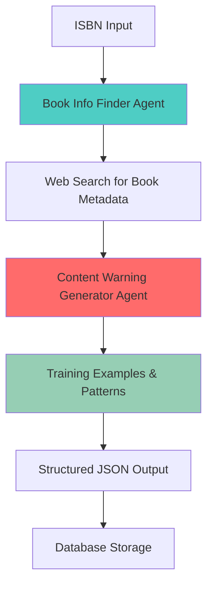
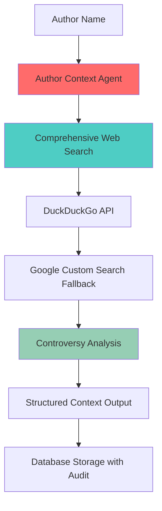
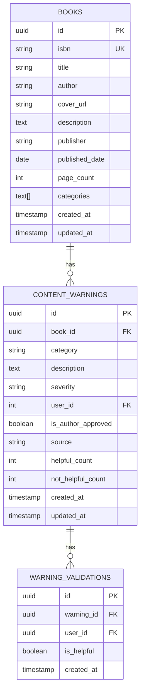

# Book Scanner App - Current Architecture Overview

## 🏗️ **System Architecture (Updated)**

## 🔄 **Enhanced Data Flow**

## 🤖 **AI Agent Architecture**

### **1. Content Warning Agent Chain**

### **2. Author Context Agent**

## 📊 **Database Schema (Updated)**

## 🎯 **Key Features**

### **Core Features**
- **ISBN/Barcode Scanning** - Camera-based scanning with ZXing
- **Book Metadata Fetching** - Google Books and Open Library APIs
- **AI Content Warning Generation** - Automated content analysis with training data
- **Book Collection** - Browse and search books with content warnings
- **User Feedback System** - Thumbs up/down on content warnings

### **AI Agent Features**
- **Agent Chain System** - Specialized micro-agents for different tasks
- **Training Data Integration** - 14+ author-approved content warning examples
- **Theme Pattern Recognition** - Structured trigger word detection
- **Structured Output** - Consistent JSON response format
- **Confidence Scoring** - AI self-assessment of results
- **Source Tracking** - Distinguish between AI-generated and user-submitted warnings

### **Database Features**
- **Source Tracking** - Track warning sources (AI, user, author, publisher)
- **Author Approval** - Mark author-approved warnings
- **User Validation** - Track helpful/not helpful feedback
- **Migration Support** - Database schema migration scripts

### **Security & Environment**
- **Environment Variables** - Secure API key management
- **Row Level Security** - Supabase RLS policies
- **Input Validation** - ISBN validation and sanitization
- **Type Safety** - Full TypeScript implementation

## 🔧 **Technology Stack**

### **Frontend**
- **Next.js 15** - React framework with App Router
- **React 19** - Latest React with concurrent features
- **TypeScript** - Type-safe development
- **Tailwind CSS** - Utility-first styling
- **shadcn/ui** - Component library
- **Lucide React** - Icon library

### **Backend**
- **Next.js API Routes** - Serverless API endpoints
- **Supabase** - PostgreSQL database with real-time features
- **OpenAI Agents** - AI agent framework
- **GPT-4o** - Language model for content analysis

### **External Services**
- **Google Books API** - Book metadata and covers
- **Open Library API** - Free book information
- **DuckDuckGo API** - Web search (primary)
- **Google Custom Search** - Web search fallback
- **ZXing** - Barcode scanning library

### **Development Tools**
- **pnpm** - Package manager
- **ESLint** - Code linting
- **Prettier** - Code formatting
- **TypeScript** - Type checking

## 🚀 **Recent Enhancements**

### **AI Agent Improvements**
- ✅ **Agent Chain Architecture** - Split into specialized micro-agents
- ✅ **Training Data Integration** - 14+ real content warning examples
- ✅ **Theme Pattern Recognition** - Structured trigger word detection
- ✅ **Category Guidelines** - Detailed severity and categorization rules
- ✅ **Source Tracking** - Distinguish AI vs user-generated warnings

### **Database Improvements**
- ✅ **Source Column** - Track warning sources (AI, user, author, publisher)
- ✅ **Author Approval** - Mark author-approved warnings
- ✅ **Migration Scripts** - Database schema migration support
- ✅ **RLS Policies** - Secure data access
- ✅ **User Validation** - Track helpful/not helpful feedback

### **UI/UX Improvements**
- ✅ **AI Warning Badge** - Visual indicator for AI-generated warnings
- ✅ **Source Display** - Show warning source in UI
- ✅ **Loading States** - Better user feedback
- ✅ **Error Handling** - Graceful failure management
- ✅ **Codebase Cleanup** - Removed 100+ legacy files

## 🔮 **Current Status**

### **Working Features**
- ✅ **ISBN Scanning** - Camera-based barcode scanning
- ✅ **Book Metadata** - Google Books and Open Library integration
- ✅ **AI Content Warnings** - Automated warning generation
- ✅ **Source Tracking** - Database tracks warning sources
- ✅ **User Feedback** - Thumbs up/down system
- ✅ **Clean Architecture** - Minimal, focused codebase

### **Ready for Production**
- ✅ **Core Functionality** - All essential features working
- ✅ **Database Migration** - Schema migration scripts available
- ✅ **Type Safety** - Full TypeScript implementation
- ✅ **Security** - RLS policies and input validation
- ✅ **Clean Codebase** - Minimal, maintainable structure

### **Future Enhancements**
1. **Performance Optimization** - Response time improvements
2. **Caching Layer** - Redis for API responses
3. **Rate Limiting** - Proper API rate management
4. **Error Monitoring** - Comprehensive logging
5. **Advanced Analytics** - Warning accuracy tracking

---

This architecture represents a comprehensive book scanning and content analysis system with AI-powered content warnings and author accountability features. The system is designed to be scalable, secure, and user-friendly while providing valuable information to readers about book content and author context.

