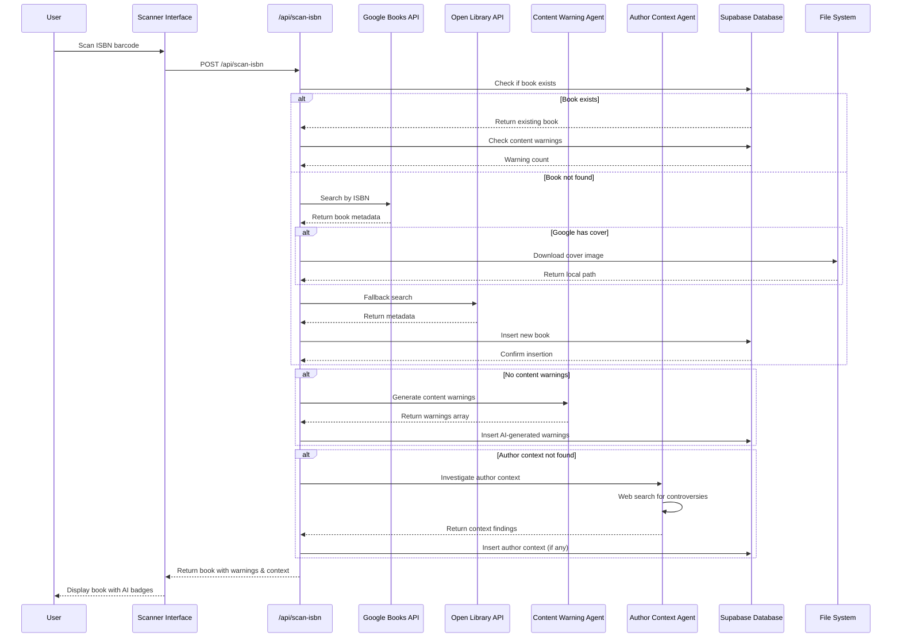
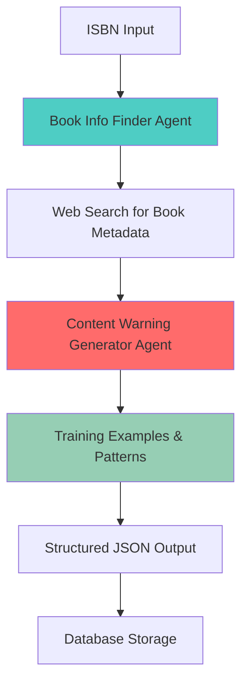
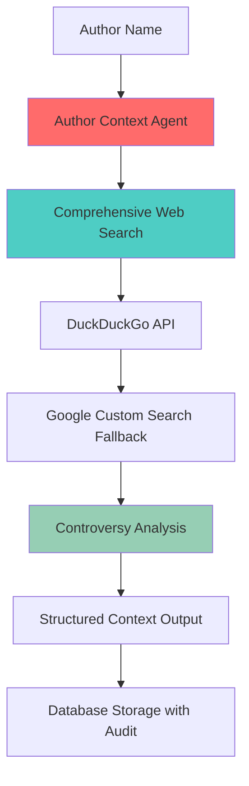
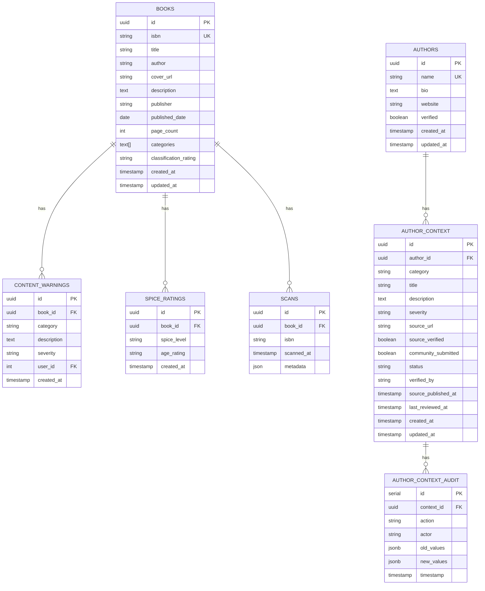

# Book Scanner App - Current Architecture Overview

## 🏗️ **System Architecture (Updated)**

```mermaid
graph TB
    %% User Interface Layer
    subgraph "Frontend (Next.js 15 + React 19)"
        UI[Scanner Interface]
        Admin[Admin Dashboard]
        Collection[Book Collection]
        BookDetails[Book Details Page]
        Demo[Author Context Demo]
        DevTool[Cover Selection Tool - DEV ONLY]
    end

    %% API Layer
    subgraph "API Routes"
        ScanAPI[/api/scan-isbn]
        ScanV2API[/api/scan-isbn-v2]
        AgentChainAPI[/api/scan-isbn-agent-chain]
        GenerateAPI[/api/generate-content-warnings]
        AuthorContextAPI[/api/author-context]
        TestAuthorAPI[/api/test-author-context-simple]
        TestWebAPI[/api/test-web-search]
        AdminAPI[/api/admin/*]
        CoverAPI[/api/update-covers]
        FetchAPI[/api/fetch-all-covers - DEV]
        ClearAPI[/api/clear-books - DEV]
        RestoreAPI[/api/restore-sample-books - DEV]
    end

    %% AI Agent Layer
    subgraph "AI Agents (OpenAI)"
        ContentAgent[Content Warning Agent]
        AuthorAgent[Author Context Agent]
        AgentChain[Agent Chain System]
        TrainingData[Training Examples & Patterns]
    end

    %% External APIs
    subgraph "External APIs"
        GoogleBooks[Google Books API]
        OpenLibrary[Open Library API]
        DuckDuckGo[DuckDuckGo API]
        GoogleSearch[Google Custom Search - Fallback]
        StoryGraph[StoryGraph API - Future]
        Amazon[Amazon API - Future]
    end

    %% Database
    subgraph "Database (Supabase)"
        BooksTable[(Books Table)]
        WarningsTable[(Content Warnings)]
        SpiceTable[(Spice Ratings)]
        ScansTable[(Scans Table)]
        AuthorsTable[(Authors Table)]
        AuthorContextTable[(Author Context)]
        AuthorAuditTable[(Author Context Audit)]
    end

    %% File System
    subgraph "File Storage"
        CoverFiles[public/book-covers/]
        Scripts[scripts/]
        ClassificationSymbols[public/classification-symbols/]
    end

    %% User Interactions
    UI --> ScanAPI
    BookDetails --> AuthorContextAPI
    Demo --> TestAuthorAPI
    Admin --> AdminAPI
    Collection --> AdminAPI
    DevTool --> CoverAPI
    DevTool --> FetchAPI

    %% API to AI Agents
    ScanAPI --> ContentAgent
    GenerateAPI --> AgentChain
    AuthorContextAPI --> AuthorAgent
    TestAuthorAPI --> AuthorAgent

    %% AI Agent Dependencies
    ContentAgent --> TrainingData
    AuthorAgent --> DuckDuckGo
    AuthorAgent --> GoogleSearch
    AgentChain --> TrainingData

    %% API to External Services
    ScanAPI --> GoogleBooks
    ScanAPI --> OpenLibrary
    AuthorAgent --> DuckDuckGo
    AuthorAgent --> GoogleSearch
    FetchAPI --> GoogleBooks
    FetchAPI --> OpenLibrary

    %% API to Database
    ScanAPI --> BooksTable
    ScanAPI --> WarningsTable
    AuthorContextAPI --> AuthorsTable
    AuthorContextAPI --> AuthorContextTable
    AdminAPI --> BooksTable
    AdminAPI --> WarningsTable
    AdminAPI --> SpiceTable
    AdminAPI --> ScansTable

    %% Database Relationships
    BooksTable --> WarningsTable
    BooksTable --> SpiceTable
    BooksTable --> ScansTable
    AuthorsTable --> AuthorContextTable
    AuthorContextTable --> AuthorAuditTable

    %% Styling
    classDef frontend fill:#e1f5fe
    classDef api fill:#f3e5f5
    classDef ai fill:#ffebee
    classDef external fill:#fff3e0
    classDef database fill:#e8f5e8
    classDef files fill:#fce4ec
    classDef dev fill:#ffebee

    class UI,Admin,Collection,BookDetails,Demo,DevTool frontend
    class ScanAPI,ScanV2API,AgentChainAPI,GenerateAPI,AuthorContextAPI,TestAuthorAPI,TestWebAPI,AdminAPI,CoverAPI,FetchAPI,ClearAPI,RestoreAPI api
    class ContentAgent,AuthorAgent,AgentChain,TrainingData ai
    class GoogleBooks,OpenLibrary,DuckDuckGo,GoogleSearch,StoryGraph,Amazon external
    class BooksTable,WarningsTable,SpiceTable,ScansTable,AuthorsTable,AuthorContextTable,AuthorAuditTable database
    class CoverFiles,Scripts,ClassificationSymbols files
    class DevTool,FetchAPI,ClearAPI,RestoreAPI dev
```

## 🔄 **Enhanced Data Flow**



## 🤖 **AI Agent Architecture**

### **1. Content Warning Agent Chain**


### **2. Author Context Agent**


## 📊 **Database Schema (Updated)**



## 🎯 **Key Features**

### **Production Features**
- **ISBN/Barcode Scanning** - Camera-based scanning with ZXing
- **Book Metadata Fetching** - Google Books and Open Library APIs
- **AI Content Warning Generation** - Automated content analysis with training data
- **Author Context & Accountability** - Automated author controversy investigation
- **Spice Rating System** - Age-appropriate content ratings
- **Admin Dashboard** - Book management and review workflow
- **Book Collection** - Browse and search books
- **Australian Classification** - Official classification display

### **AI Agent Features**
- **Agent Chain System** - Specialized micro-agents for different tasks
- **Training Data Integration** - 14+ author-approved content warning examples
- **Theme Pattern Recognition** - Structured trigger word detection
- **Web Search Integration** - Real-time information gathering
- **Structured Output** - Consistent JSON response format
- **Confidence Scoring** - AI self-assessment of results

### **Development Tools (DEV ONLY)**
- **Cover Selection Tool** - Visual interface for choosing covers
- **API Cover Fetching** - Comprehensive multi-API cover search
- **Database Management** - Clear and restore sample data
- **Quality Assessment** - File size and source-based quality indicators
- **Agent Testing Endpoints** - Isolated testing of AI components

### **Security & Environment**
- **Development Mode Protection** - Dev tools only work in development
- **Environment Variables** - Secure API key management
- **Row Level Security** - Supabase RLS policies
- **Input Validation** - ISBN validation and sanitization
- **Audit Logging** - Complete audit trail for author context changes

## 🔧 **Technology Stack**

### **Frontend**
- **Next.js 15** - React framework with App Router
- **React 19** - Latest React with concurrent features
- **TypeScript** - Type-safe development
- **Tailwind CSS** - Utility-first styling
- **shadcn/ui** - Component library
- **Lucide React** - Icon library

### **Backend**
- **Next.js API Routes** - Serverless API endpoints
- **Supabase** - PostgreSQL database with real-time features
- **OpenAI Agents** - AI agent framework
- **GPT-4o** - Language model for content analysis

### **External Services**
- **Google Books API** - Book metadata and covers
- **Open Library API** - Free book information
- **DuckDuckGo API** - Web search (primary)
- **Google Custom Search** - Web search fallback
- **ZXing** - Barcode scanning library

### **Development Tools**
- **pnpm** - Package manager
- **ESLint** - Code linting
- **Prettier** - Code formatting
- **TypeScript** - Type checking

## 🚀 **Recent Enhancements**

### **AI Agent Improvements**
- ✅ **Agent Chain Architecture** - Split into specialized micro-agents
- ✅ **Training Data Integration** - 14+ real content warning examples
- ✅ **Theme Pattern Recognition** - Structured trigger word detection
- ✅ **Category Guidelines** - Detailed severity and categorization rules
- ✅ **Web Search Integration** - Real-time information gathering

### **Author Context System**
- ✅ **Database Schema** - Authors, author_context, and audit tables
- ✅ **AI Investigation Agent** - Automated controversy detection
- ✅ **Web Search Fallback** - DuckDuckGo + Google Custom Search
- ✅ **Audit Logging** - Complete change tracking
- ✅ **RLS Policies** - Secure data access
- ✅ **Auto-verification** - Trusted source auto-approval

### **UI/UX Improvements**
- ✅ **Author Context Display** - New component for author information
- ✅ **Demo Page** - Interactive testing interface
- ✅ **Loading States** - Better user feedback
- ✅ **Error Handling** - Graceful failure management

## 🔮 **Current Issues & Next Steps**

### **Known Issues**
- ❌ **Web Search Not Working** - DuckDuckGo API returns empty results
- ❌ **Google API Keys Not Set** - Fallback search unavailable
- ❌ **Recent Information Missed** - Neil Gaiman allegations not found

### **Immediate Next Steps**
1. **Fix Web Search** - Implement working search API
2. **Add Google API Keys** - Enable fallback search
3. **Test Author Context** - Verify controversy detection
4. **Database Migration** - Ensure all tables are created

### **Future Enhancements**
1. **Multiple Search Sources** - Bing, SerpAPI, etc.
2. **Caching Layer** - Redis for API responses
3. **Rate Limiting** - Proper API rate management
4. **Error Monitoring** - Comprehensive logging
5. **Performance Optimization** - Response time improvements

---

This architecture represents a comprehensive book scanning and content analysis system with AI-powered content warnings and author accountability features. The system is designed to be scalable, secure, and user-friendly while providing valuable information to readers about book content and author context.


