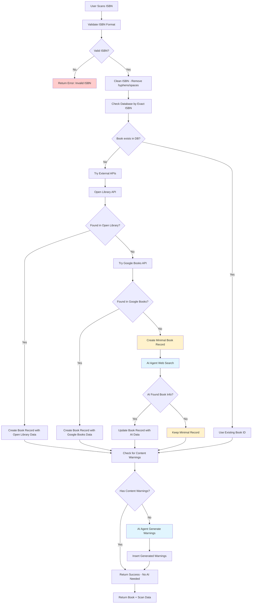

# Current ISBN Lookup Flow

## Current Architecture Flowchart



## Key Issues with Current Flow

### ❌ **Single ISBN Limitation**
- Only checks exact ISBN match in database
- No support for multiple ISBNs per book
- No cross-reference between different editions

### ❌ **No Deduplication**
- Same book with different ISBNs creates separate records
- No fuzzy matching by title/author
- Duplicate content warnings possible

### ❌ **External API Dependency**
- If external APIs don't have the ISBN, we create minimal records
- No fallback to search by title/author
- AI agent only runs when external APIs fail

### ❌ **No ISBN Relationship Tracking**
- Can't link related ISBNs (hardcover vs paperback)
- No way to find alternative ISBNs for same book
- No ISBN history or versioning

## Example Problem Scenarios

### Scenario 1: Same Book, Different Editions
```
ISBN 978-0-06-112008-4 → To Kill a Mockingbird (Paperback)
ISBN 978-0-06-112008-5 → To Kill a Mockingbird (Hardcover)
Result: Two separate book records in database
```

### Scenario 2: ISBN Not in External APIs
```
ISBN 978-1234567890 → Not found in Open Library/Google Books
Result: Minimal record created, AI agent tries to find info
```

### Scenario 3: User Scans Different ISBN for Same Book
```
Database has: ISBN 978-0-06-112008-4 (To Kill a Mockingbird)
User scans: ISBN 978-0-06-112008-5 (Same book, different edition)
Result: New book record created instead of linking to existing
```

## Current Database Schema
```sql
books table:
- id (UUID, Primary Key)
- isbn (VARCHAR(13), UNIQUE) ← Only one ISBN per book
- title, author, cover_url, etc.
- No support for multiple ISBNs
- No ISBN relationships
```

