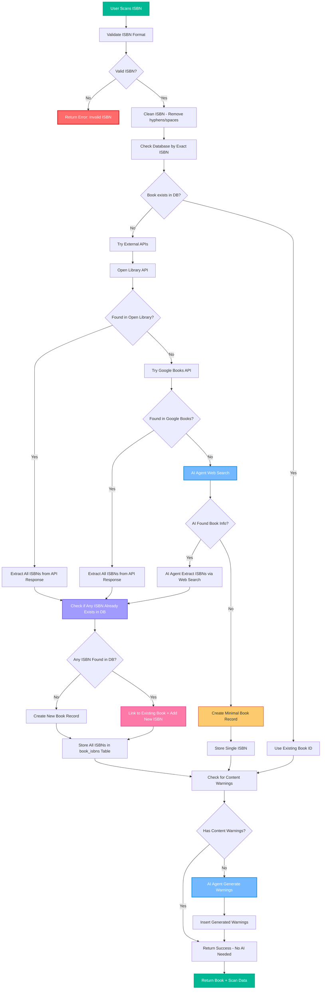

# Enhanced ISBN Lookup Flow

## Improved Architecture with Multiple ISBN Support



## New Database Schema

```sql
-- Main books table (one record per unique book)
CREATE TABLE books (
  id UUID PRIMARY KEY DEFAULT gen_random_uuid(),
  title TEXT NOT NULL,
  author TEXT,
  cover_url TEXT,
  description TEXT,
  publisher TEXT,
  published_date DATE,
  page_count INTEGER,
  categories TEXT[],
  canonical_isbn VARCHAR(13), -- Primary ISBN for display
  created_at TIMESTAMP WITH TIME ZONE DEFAULT NOW(),
  updated_at TIMESTAMP WITH TIME ZONE DEFAULT NOW()
);

-- ISBN aliases table (multiple ISBNs per book)
CREATE TABLE book_isbns (
  id UUID PRIMARY KEY DEFAULT gen_random_uuid(),
  book_id UUID REFERENCES books(id) ON DELETE CASCADE,
  isbn VARCHAR(13) UNIQUE NOT NULL,
  isbn_type VARCHAR(50), -- hardcover, paperback, ebook, audiobook, etc.
  is_primary BOOLEAN DEFAULT FALSE,
  source VARCHAR(50), -- openlibrary, google_books, ai_agent, manual
  created_at TIMESTAMP WITH TIME ZONE DEFAULT NOW()
);

-- Index for fast ISBN lookups
CREATE INDEX idx_book_isbns_isbn ON book_isbns(isbn);
CREATE INDEX idx_book_isbns_book_id ON book_isbns(book_id);
```

## Key Improvements

### 🆕 **Multiple ISBN Support**
- Store all ISBNs for each book in `book_isbns` table
- Track ISBN types (hardcover, paperback, ebook, etc.)
- Mark primary ISBN for display purposes

### 🔄 **Enhanced Lookup Logic**
1. **Extract All ISBNs** from external API responses
2. **Cross-reference** existing ISBNs in database
3. **Link to existing book** if any ISBN already exists
4. **Store new ISBNs** for future lookups

### 🎯 **Benefits**
- **No Duplicates**: Same book with different ISBNs links to same record
- **Complete Coverage**: Store all known ISBNs for each book
- **Better UX**: Users can scan any ISBN and find the same book
- **Accurate Data**: One set of content warnings per book, not per ISBN
- **ISBN Tracking**: Know format/edition of each ISBN

### 🔍 **Example Scenario**
```
User scans: 978-0-06-112008-4 (To Kill a Mockingbird Paperback)
External API returns: 
- 978-0-06-112008-4 (paperback)
- 978-0-06-112008-5 (hardcover) 
- 978-0-06-112008-6 (ebook)

Result: All three ISBNs stored, linked to same book record
Future scans of any ISBN will find the same book
```

## Implementation Steps

1. **Create new database schema** with `book_isbns` table
2. **Migrate existing data** to new structure
3. **Update API logic** to extract and store multiple ISBNs
4. **Enhance AI agent** to find alternative ISBNs
5. **Update frontend** to handle multiple ISBNs per book

