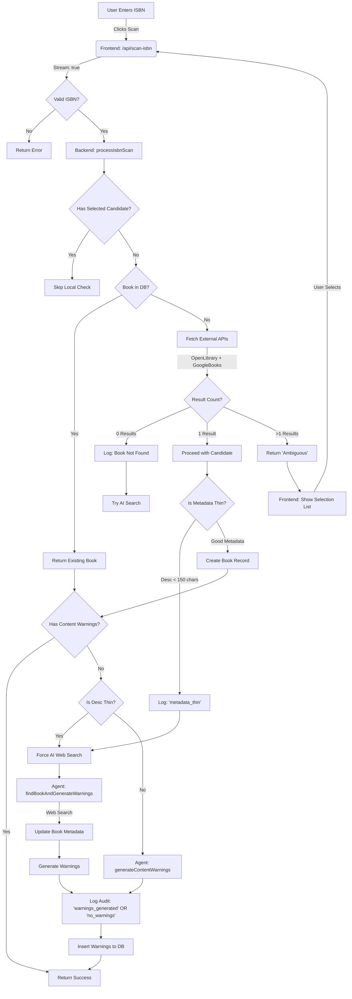

# ISBN Scan Logic Flow

This document outlines the logic flow from the moment a user enters an ISBN in the scan test page.

## Detailed Process Description

### 1. Initiation
*   **User** enters ISBN on `/scan-test` or scans a barcode.
*   **Frontend** sends a POST request to `/api/scan-isbn` with `stream: true`.

### 2. Validation & Local Lookup
*   **Validation**: The API checks if the ISBN is valid (10 or 13 digits).
*   **Local DB**: Checks Supabase `books` table.
    *   If found: Returns the book immediately.
    *   *Exception*: If the user manually selected a specific book from an ambiguous list, we skip the local check to force processing the selected candidate.

### 3. External Data Fetching (The "Ambiguity Check")
*   **Parallel Fetch**: The system queries **Open Library** and **Google Books** simultaneously.
*   **Candidate Analysis**:
    *   **0 Matches**: Marks as "Unknown", prepares for deep AI search.
    *   **1 Match**: Proceeds automatically.
    *   **>1 Match**: Returns `status: ambiguous` with a list of candidates. The frontend displays a UI for the user to pick the correct book. The flow stops here until user selection.

### 4. Metadata Assessment ("Thin Metadata" Logic)
*   Once a single book is identified (automatically or via selection), we check the quality of the metadata.
*   **Thin Metadata Rule**: If the description is missing or shorter than **150 characters**:
    *   An audit log entry `metadata_thin` is created.
    *   The system forces a **Deep AI Web Search** instead of relying on the provided text.

### 5. Content Warning Generation
*   **Path A (Deep Search)**: Used for "Thin Metadata" or unknown books.
    *   AI Agent performs a Google Search for "Book Title + parent review", "content warnings", "controversy".
    *   Updates the book's title/author/description in the database with findings.
*   **Path B (Standard Analysis)**: Used when metadata is good.
    *   AI Agent analyzes the provided title, description, and categories.
*   **Severity Rating**: AI assigns specific Australian Classification ratings (G, PG, M, MA15+, R18+).

### 6. Audit Logging
*   Every AI decision is recorded in the `ai_audit_logs` table.
*   **Types**:
    *   `search_performed`: Web search was used.
    *   `warnings_generated`: Specific triggers found.
    *   `no_warnings`: AI explicitly decided the book is safe (includes reasoning).

### 7. Completion
*   Progress updates are streamed to the user (e.g., "Analyzing content...", "Saving 3 warnings...").
*   Final result returns the Book object and any generated warnings.

