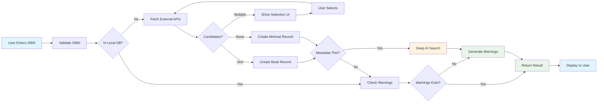
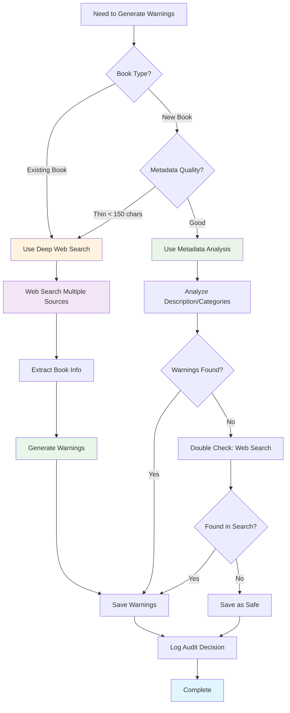
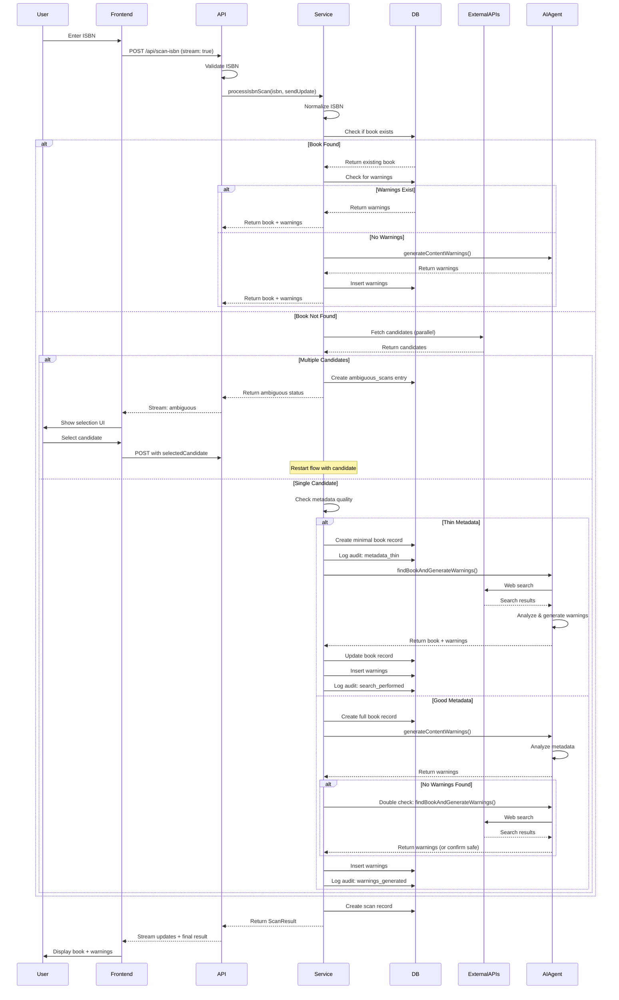
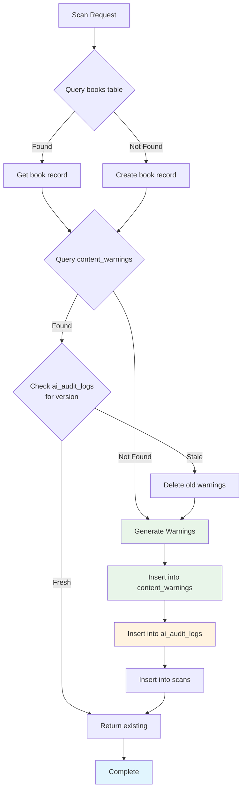
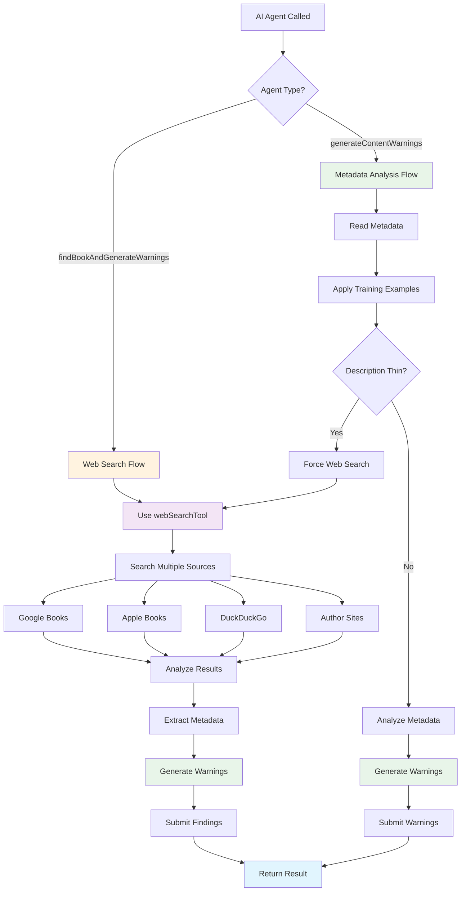

# ISBN Scan Flow - Mermaid Diagram

## Complete Flow Diagram

```mermaid
flowchart TD
    Start([User Enters ISBN]) --> Validate{Validate ISBN Format}
    Validate -->|Invalid| Error1[Return 400 Error]
    Validate -->|Valid| API[API Route: /api/scan-isbn]
    
    API --> Stream{Stream Mode?}
    Stream -->|Yes| CreateStream[Create ReadableStream]
    Stream -->|No| DirectCall[Direct Call]
    
    CreateStream --> ProcessScan[processIsbnScan]
    DirectCall --> ProcessScan
    
    ProcessScan --> Normalize[Normalize ISBN]
    Normalize --> CheckDB{Book in Local DB?}
    
    CheckDB -->|Found & No Candidate| UseExisting[Use Existing Book]
    CheckDB -->|Not Found OR Has Candidate| FetchExternal[Fetch External Metadata]
    
    UseExisting --> CheckWarnings{Has Content Warnings?}
    
    FetchExternal --> ParallelAPIs[Parallel API Calls]
    ParallelAPIs --> OpenLib[Open Library API]
    ParallelAPIs --> GoogleBooks[Google Books API]
    
    OpenLib --> MergeResults[Merge Results]
    GoogleBooks --> MergeResults
    
    MergeResults --> CandidateCount{How Many Candidates?}
    
    CandidateCount -->|0 Candidates| CreateMinimal[Create Minimal Book Record]
    CandidateCount -->|1 Candidate| UseCandidate[Use Single Candidate]
    CandidateCount -->|2+ Candidates| Ambiguous[Create ambiguous_scans Entry]
    
    Ambiguous --> ReturnAmbiguous[Return status: 'ambiguous']
    ReturnAmbiguous --> FrontendSelect[Frontend: Show Selection UI]
    FrontendSelect --> UserSelects[User Selects Candidate]
    UserSelects --> ProcessScan
    
    CreateMinimal --> CheckMetadata{Is Metadata Thin?}
    UseCandidate --> CheckMetadata
    
    CheckMetadata{Description < 150 chars<br/>OR missing cover?}
    CheckMetadata -->|Yes - Thin| LogThin[Log audit: 'metadata_thin']
    CheckMetadata -->|No - Good| CreateFull[Create Full Book Record]
    
    LogThin --> DeepSearch[Deep AI Web Search]
    DeepSearch --> AIAgent1[AI Agent: findBookAndGenerateWarnings]
    
    AIAgent1 --> WebSearch[Web Search Tool]
    WebSearch --> SearchGoogle[Google Books API]
    WebSearch --> SearchApple[Apple Books API]
    WebSearch --> SearchDDG[DuckDuckGo API]
    WebSearch --> SearchAuthor[Author Site Scraping]
    
    SearchGoogle --> AnalyzeResults[Analyze Search Results]
    SearchApple --> AnalyzeResults
    SearchDDG --> AnalyzeResults
    SearchAuthor --> AnalyzeResults
    
    AnalyzeResults --> ExtractData[Extract: title, author, description, cover]
    ExtractData --> GenerateWarnings1[Generate Content Warnings]
    GenerateWarnings1 --> UpdateBook[Update Book Record]
    UpdateBook --> LogSearch[Log audit: 'search_performed']
    
    LogSearch --> HasWarnings1{Warnings Found?}
    HasWarnings1 -->|Yes| InsertWarnings1[Insert Warnings to DB]
    HasWarnings1 -->|No| LogNoWarnings1[Log audit: 'no_warnings']
    
    InsertWarnings1 --> LogGenerated1[Log audit: 'warnings_generated']
    LogNoWarnings1 --> ReturnResult1[Return Result]
    LogGenerated1 --> ReturnResult1
    
    CreateFull --> CheckWarnings
    
    CheckWarnings{Warnings Exist?}
    CheckWarnings -->|Yes| CheckStale{Are Warnings Stale?}
    CheckWarnings -->|No| GenerateWarnings
    
    CheckStale{Old model_version<br/>OR taxonomy_version?}
    CheckStale -->|Yes| DeleteOld[Delete Old Warnings]
    CheckStale -->|No| ReturnExisting[Return Existing Book + Warnings]
    
    DeleteOld --> GenerateWarnings
    
    GenerateWarnings --> Strategy{Generation Strategy?}
    
    Strategy -->|Existing Book OR<br/>Thin Metadata OR<br/>Force Refresh| UseDeepSearch[Use Deep Web Search]
    Strategy -->|New Book with<br/>Good Metadata| UseMetadata[Use Metadata Analysis]
    
    UseDeepSearch --> CheckCache{Cached Result<br/>Available?}
    CheckCache -->|Yes| UseCache[Use Cached Result]
    CheckCache -->|No| AIAgent2[AI Agent: findBookAndGenerateWarnings]
    
    AIAgent2 --> WebSearch
    
    UseCache --> ProcessCached[Process Cached Warnings]
    ProcessCached --> InsertWarnings2[Insert Warnings to DB]
    
    UseMetadata --> AIAgent3[AI Agent: generateContentWarnings]
    AIAgent3 --> AnalyzeMetadata[Analyze: title, author, description, categories]
    AnalyzeMetadata --> ApplyTaxonomy[Apply Taxonomy & Training Examples]
    ApplyTaxonomy --> GenerateWarnings2[Generate Warnings]
    
    GenerateWarnings2 --> CheckEmpty{Warnings Found?}
    CheckEmpty -->|No| DoubleCheck[Double Check with Web Search]
    CheckEmpty -->|Yes| InsertWarnings3[Insert Warnings to DB]
    
    DoubleCheck --> AIAgent4[AI Agent: findBookAndGenerateWarnings]
    AIAgent4 --> WebSearch
    
    InsertWarnings2 --> LogGenerated2[Log audit: 'warnings_generated']
    InsertWarnings3 --> LogGenerated2
    
    LogGenerated2 --> CreateScan[Create Scan Record]
    CreateScan --> ReturnResult[Return ScanResult]
    
    ReturnResult --> StreamResponse{Stream Mode?}
    StreamResponse -->|Yes| StreamUpdates[Stream Progress Updates]
    StreamResponse -->|No| JSONResponse[Return JSON Response]
    
    StreamUpdates --> Frontend[Frontend Receives Updates]
    JSONResponse --> Frontend
    
    Frontend --> DisplayResult[Display Book + Warnings]
    ReturnExisting --> Frontend
    
    Error1 --> Frontend
    
    style Start fill:#e1f5fe
    style Error1 fill:#ffebee
    style DeepSearch fill:#fff3e0
    style AIAgent1 fill:#f3e5f5
    style AIAgent2 fill:#f3e5f5
    style AIAgent3 fill:#f3e5f5
    style AIAgent4 fill:#f3e5f5
    style GenerateWarnings fill:#e8f5e8
    style ReturnResult fill:#e8f5e8
    style Frontend fill:#e1f5fe
```

## Simplified High-Level Flow

## Decision Tree for Content Warning Generation

## Sequence Diagram: Complete Flow

## Database Operations Flow

## AI Agent Decision Flow

