# Multi-Model Content Warning System - Flow Diagram

```mermaid
flowchart TD
    Start([User Enters ISBN]) --> Validate[Validate ISBN Format]
    Validate -->|Invalid| Error1[Return 400 Error]
    Validate -->|Valid| Normalize[Normalize ISBN]
    
    Normalize --> CheckDB{Book Exists<br/>in Database?}
    CheckDB -->|Yes| ExistingBook[Load Existing Book]
    CheckDB -->|No| FetchMeta[Fetch Book Metadata<br/>from External APIs]
    
    FetchMeta -->|No Results| Error2[Return 404 Error]
    FetchMeta -->|Success| BookData[Extract Book Data<br/>Title, Author, Description, Categories]
    
    BookData --> MultiModel[Run Multi-Model Analysis]
    
    MultiModel --> Parallel[Promise.allSettled<br/>Run Both Models in Parallel]
    
    Parallel --> GPT4o[GPT-4o Analysis]
    Parallel --> Gemini[Gemini Analysis]
    
    GPT4o --> GPT4oWeb[Web Search:<br/>Google Books, Apple Books,<br/>DuckDuckGo, Author Sites]
    GPT4oWeb --> GPT4oAgent[Content Warning Agent<br/>with Hybrid Instructions]
    GPT4oAgent --> GPT4oClassify[Severity Classification Agent<br/>Context-Aware Severity]
    GPT4oClassify --> GPT4oResult[GPT-4o Results:<br/>Warnings, Rating, Confidence]
    
    Gemini --> GeminiDirect[Direct Analysis:<br/>Book Metadata Only]
    GeminiDirect --> GeminiAgent[Gemini Content Warning Agent]
    GeminiAgent --> GeminiResult[Gemini Results:<br/>Warnings, Rating, Confidence]
    
    GPT4oResult --> ErrorHandling{Both Models<br/>Completed?}
    GeminiResult --> ErrorHandling
    
    ErrorHandling -->|GPT-4o Failed| GPT4oFallback[GPT-4o: Empty Result<br/>Low Confidence]
    ErrorHandling -->|Gemini Failed| GeminiFallback[Gemini: Empty Result<br/>Low Confidence]
    ErrorHandling -->|Both Failed| BothFailed[Return Error]
    ErrorHandling -->|At Least One Success| Combine[Combine Results]
    
    GPT4oFallback --> Combine
    GeminiFallback --> Combine
    
    Combine --> CombineWarnings[Combine Warnings:<br/>- MAX scores for same category<br/>SAFETY: If one model found severe, warn<br/>- Include unique findings<br/>- Validate subcategories]
    CombineWarnings --> Analyze[Analyze Differences:<br/>- Agreement Score<br/>- Unique to GPT-4o<br/>- Unique to Gemini<br/>- Severity Differences]
    
    Analyze --> CombineRating[Combine Classification Rating:<br/>Use More Restrictive]
    CombineRating --> CombineConfidence[Combine Confidence:<br/>Use Confidence of Model<br/>That Found Warnings]
    
    CombineConfidence --> MultiModelResult[Multi-Model Result:<br/>Combined Warnings, Rating,<br/>Confidence, Analysis]
    
    MultiModelResult --> SaveDB{Save to Database}
    
    SaveDB --> DeleteOld[Delete Existing Warnings<br/>for This Book]
    DeleteOld --> ValidateSubcats[Validate Subcategories<br/>Against Taxonomy]
    ValidateSubcats --> InsertWarnings[Insert Combined Warnings<br/>with Validation]
    InsertWarnings --> UpdateBook{Book Exists?}
    
    UpdateBook -->|Yes| UpdateExisting[Update Book Metadata<br/>Add Classification Rating]
    UpdateBook -->|No| CreateNew[Create New Book Record<br/>with Metadata]
    
    UpdateExisting --> RecordScan[Record Scan in Scans Table]
    CreateNew --> RecordScan
    
    RecordScan --> ReturnResult[Return JSON Response:<br/>Book, Warnings, Analysis]
    
    ReturnResult --> Frontend[Frontend Receives Result]
    Frontend --> Transform[Transform Result Format]
    Transform --> Display[Display on UI:<br/>- Book Details<br/>- Content Warnings<br/>- Multi-Model Analysis<br/>- Agreement Score]
    
    Display --> SaveHistory[Save to Scan History<br/>LocalStorage]
    SaveHistory --> End([Scan Complete])
    
    Error1 --> End
    Error2 --> End
    BothFailed --> End
    
    style Start fill:#e1f5ff
    style End fill:#c8e6c9
    style MultiModel fill:#fff3e0
    style Parallel fill:#f3e5f5
    style GPT4o fill:#e3f2fd
    style Gemini fill:#e8f5e9
    style Combine fill:#fff9c4
    style SaveDB fill:#fce4ec
    style Display fill:#e0f2f1
```

## Key Components

### 1. **Input Validation**
- ISBN format validation (10 or 13 digits)
- Normalization (remove hyphens, convert ISBN-10 to ISBN-13)

### 2. **Book Metadata Fetching**
- Check database for existing book
- Fetch from external APIs (Google Books, Apple Books, etc.)
- Extract: title, author, description, categories, cover URL

### 3. **Multi-Model Analysis (Parallel)**
- **GPT-4o**: Web search + hybrid instructions + classification agent
- **Gemini**: Direct analysis from metadata + classification
- Both run in parallel using `Promise.allSettled`
- Graceful error handling (one can fail, other continues)

### 4. **Result Combination (Safety-First)**
- **Warnings**: **MAX scores** for same category (safety-first: if one model found severe content, warn about it)
- **Rating**: Use more restrictive classification (e.g., MA15+ over M)
- **Confidence**: Use confidence of model that found warnings (or higher if both found them)
- **Analysis**: Calculate agreement score, identify differences

### 5. **Database Operations**
- Validate subcategories against taxonomy
- Delete old warnings (if re-scanning)
- Insert/update book record
- Insert combined warnings with validation
- Record scan in audit table

### 6. **Frontend Display**
- Transform result format
- Display book details
- Show content warnings with severity
- Display multi-model analysis (agreement score, unique findings)
- Save to scan history

## Error Handling

- **ISBN Invalid**: Return 400 error immediately
- **Book Not Found**: Return 404 after metadata fetch fails
- **Model Failure**: Continue with other model's results, mark confidence as 'low'
- **Both Models Fail**: Return error response
- **Database Error**: Log error, continue with response (non-blocking)

## Performance

- **Parallel Execution**: Both models run simultaneously (~20-25s total)
- **No Sequential Bottlenecks**: Metadata fetch → Parallel analysis → Database save
- **Graceful Degradation**: System works even if one model fails

