# Book Scan Flow Diagram

## Current Scan Process (Post-Fix)

```mermaid
flowchart TD
    Start([User enters ISBN]) --> Frontend[Frontend: Scan Page]
    Frontend -->|POST /api/scan| API[API Route: /api/scan]
    
    API -->|processIsbnScan| ScanService[Scan Service]
    
    ScanService --> CheckDB{Book exists<br/>in database?}
    
    CheckDB -->|No| FetchMetadata[Fetch from Google Books API]
    CheckDB -->|Yes| UseExisting[Use existing book data]
    
    FetchMetadata --> ValidateCover[Validate cover URL]
    ValidateCover --> SaveBook[Save book to database]
    UseExisting --> GetBookId[Get book ID]
    SaveBook --> GetBookId
    
    GetBookId --> CheckDescription{Description<br/>exists & >100 chars?}
    
    CheckDescription -->|No| FetchDescription[Fetch fresh description]
    CheckDescription -->|Yes| UseDescription[Use existing description]
    
    FetchDescription --> UseDescription
    
    UseDescription --> CheckMinimal{Description<br/>minimal?}
    
    CheckMinimal -->|Yes| WebSearch[Web search for context]
    CheckMinimal -->|No| SkipWebSearch[Skip web search]
    
    WebSearch --> EnhanceDescription[Enhance description with context]
    SkipWebSearch --> Analyze[Call analyzeBookWithMultiModel]
    EnhanceDescription --> Analyze
    
    Analyze --> OpenAI[OpenAI Analysis]
    OpenAI --> ProcessWarnings[Process Warnings]
    
    ProcessWarnings --> BuildSignals[Build Severity Signals]
    BuildSignals --> ComputeSeverity[Compute Severity from Signals]
    ComputeSeverity --> UpdateReasoning[Update Reasoning to Match Severity]
    UpdateReasoning --> ReturnWarnings[Return Warnings]
    
    ReturnWarnings --> Verify{Unique warnings<br/>found?}
    
    Verify -->|Yes| VerifyStep[Verify Unique Warnings]
    Verify -->|No| Combine[Combine Results]
    
    VerifyStep --> Adjust{Verification<br/>adjusts severity?}
    
    Adjust -->|Yes| UpdateReasoningAgain[Update Reasoning for Adjusted Severity]
    Adjust -->|No| KeepOriginal[Keep Original Reasoning]
    
    UpdateReasoningAgain --> Combine
    KeepOriginal --> Combine
    
    Combine --> SaveWarnings[Save Warnings to Database]
    SaveWarnings --> CreateAuditLog[Create Audit Log]
    CreateAuditLog --> SafetyCheck[Safety Check: Ensure Audit Log Exists]
    SafetyCheck --> StreamProgress[Stream Progress to Frontend]
    
    StreamProgress --> FrontendDisplay[Frontend: Display Results]
    FrontendDisplay --> ShowBook[Show Book Details]
    ShowBook --> ShowWarnings[Show Content Warnings]
    ShowWarnings --> End([Scan Complete])
    
    style Start fill:#e1f5ff
    style End fill:#c8e6c9
    style UpdateReasoning fill:#fff9c4
    style UpdateReasoningAgain fill:#fff9c4
    style ComputeSeverity fill:#ffccbc
    style VerifyStep fill:#e1bee7
    style SaveWarnings fill:#b2dfdb
```



## Key Components

### 1. Frontend (app/scan/page.tsx)
- User enters ISBN
- Sends POST request to `/api/scan`
- Receives SSE stream with progress updates
- Displays book details and warnings

### 2. API Route (app/api/scan/route.ts)
- Handles POST request
- Calls `processIsbnScan`
- Streams progress updates via SSE
- Returns final result

### 3. Scan Service (lib/services/scan-service.ts)
- Fetches/validates book metadata
- Saves book to database
- Manages description fetching
- Calls multi-model analysis
- Saves warnings and creates audit logs

### 4. Multi-Model Analysis (lib/services/multi-model-analysis.ts)
- **analyzeWithOpenAI**: Gets raw warnings from GPT-4o
- **processWarnings**: 
  - Builds severity signals
  - Computes severity from signals
  - **Updates reasoning to match computed severity** ⭐
- **verifyUniqueWarnings**: 
  - Verifies unique warnings
  - Can adjust severity
  - **Updates reasoning if severity adjusted** ⭐
- **combineResults**: Combines OpenAI and Gemini results

### 5. Severity Computation (lib/utils/severity-computation.ts)
- Builds signals from warning data
- Computes severity using formula:
  - Base score = (frequency × 0.3) + (explicitness × 0.4)
  - Multipliers: proximity, centrality
  - Intensity bonus
  - Maps to: mild (< 0.35), moderate (< 0.70), severe (≥ 0.70)

## Recent Fixes Applied

1. **Reasoning/Severity Matching**: 
   - Reasoning text now matches computed severity
   - Updated when severity is computed
   - Updated again if verification adjusts severity

2. **Frontend Hydration Fix**:
   - Added `isMounted` check for localStorage
   - Prevents server/client mismatch

3. **Scope Error Fixes**:
   - Fixed `bookForAnalysis` scope issues
   - Proper variable lifecycle management

## Data Flow

```
User Input (ISBN)
  ↓
Frontend Validation
  ↓
API Route (SSE Stream)
  ↓
Scan Service
  ├─→ Book Metadata Fetch
  ├─→ Database Save
  └─→ Multi-Model Analysis
       ├─→ OpenAI Analysis
       ├─→ Process Warnings
       │    ├─→ Build Signals
       │    ├─→ Compute Severity
       │    └─→ Update Reasoning ⭐
       ├─→ Verify Warnings
       │    └─→ Update Reasoning (if adjusted) ⭐
       └─→ Combine Results
  ↓
Save to Database
  ├─→ Content Warnings
  └─→ Audit Log
  ↓
Stream to Frontend
  ↓
Display Results
```

## Severity Computation Formula

```
baseScore = (frequency × 0.3) + (explicitness × 0.4)
proximityMultiplier = 1 + (proximity × 0.2)
centralityMultiplier = 1 + (centrality × 0.2)
intensityBonus = min(intensity_markers.length × 0.1, 0.3)

finalScore = (baseScore × proximityMultiplier × centralityMultiplier) + intensityBonus
normalizedScore = min(finalScore, 1.0)

Severity:
- mild: normalizedScore < 0.35
- moderate: 0.35 ≤ normalizedScore < 0.70
- severe: normalizedScore ≥ 0.70
```

## Reasoning Update Logic

1. **Initial Update** (in `processWarnings`):
   - After severity is computed from signals
   - Replaces AI's severity claims with computed severity
   - Preserves rest of reasoning text

2. **Verification Update** (in `verifyUniqueWarnings`):
   - If verification adjusts severity
   - Updates reasoning again to match new severity
   - Ensures consistency even after adjustments

