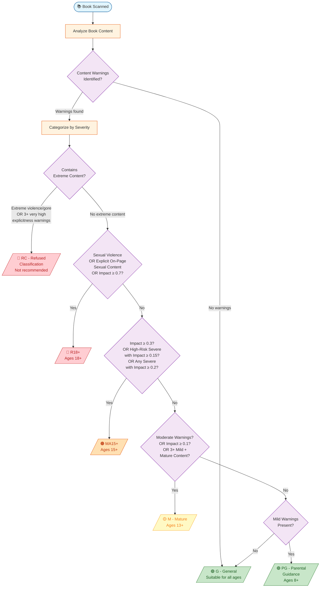
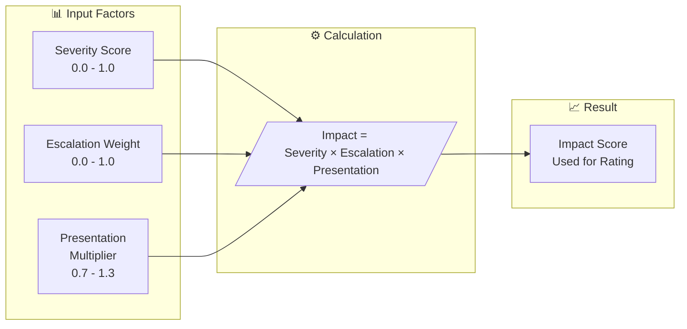
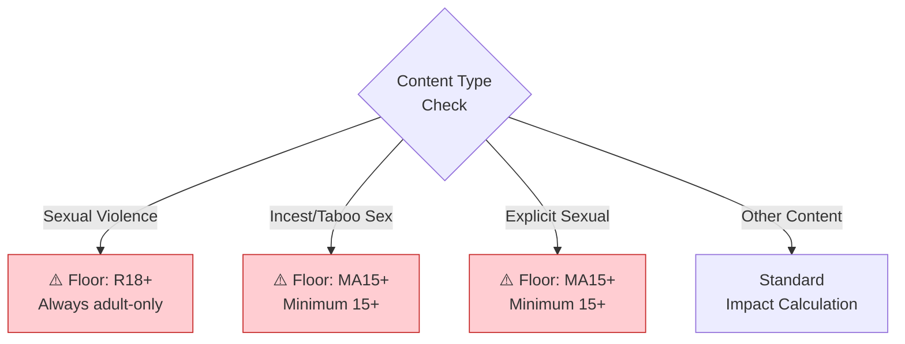

# Australian Classification Board - Book Rating Decision Tree

This diagram shows how Subtext assigns age ratings based on the Australian Classification Board methodology.

## Overview

The classification process evaluates **6 classifiable elements**: Themes, Violence, Sex, Language, Drug Use, and Nudity. Each content warning is assessed for:
- **Severity** (Mild / Moderate / Severe)  
- **Escalation Weight** (how much the content type escalates the rating)
- **Presentation** (on-page vs referenced, graphic vs vague detail)

These factors combine to produce an **Impact Score** that determines the final rating.

---

## Decision Tree

---

## Impact Score Calculation

---

## Escalation Weights by Category

| Category | Content Type | Weight | Typical Rating |
|----------|--------------|--------|----------------|
| **Violence** | Physical violence | 0.45 | MA15+ |
| | Graphic violence | 0.70 | R18+ |
| | Torture | 0.75 | R18+ |
| | Child harm | 0.80 | R18+ |
| **Sexual** | Intense romance | 0.58 | MA15+ |
| | Explicit content | 0.70 | R18+ |
| | Sexual violence | 0.90 | R18+ |
| **Mental Health** | Depression/PTSD | 0.40-0.45 | MA15+ |
| | Self-harm | 0.60 | MA15+ |
| | Suicidal ideation | 0.65 | R18+ |
| **Tropes** | Dark romance | 0.60 | MA15+ |
| | Stalker/Kidnapping | 0.75 | R18+ |

---

## Rating Floors

Certain content types enforce a **minimum rating floor** regardless of calculated impact:

---

## Presentation Multiplier

How content is presented affects its impact:

| Explicitness | Detail Level | Multiplier |
|--------------|--------------|------------|
| ≥ 0.8 | Graphic | 1.15× |
| ≥ 0.5 | Moderate | 1.00× |
| ≥ 0.3 | Vague/Clinical | 0.90× |
| < 0.3 | Very Vague | 0.85× |

| Proximity | Presence | Multiplier |
|-----------|----------|------------|
| ≥ 0.9 | On-page | 1.10× |
| ≥ 0.6 | Flashback | 1.00× |
| ≥ 0.4 | Off-page | 0.95× |
| ≥ 0.25 | Referenced | 0.90× |
| < 0.25 | Implied | 0.85× |

---

## Classification Summary

| Rating | Age | Description |
|--------|-----|-------------|
| **G** | All ages | No warnings or very mild impact |
| **PG** | 8+ | Mild warnings with mild impact |
| **M** | 13+ | Moderate warnings or content |
| **MA15+** | 15+ | Strong impact, restricted to 15+ |
| **R18+** | 18+ | High impact, adult-only content |
| **RC** | N/A | Refused classification, extreme content |

---

*Based on the [Australian Classification Board Guidelines](https://www.classification.gov.au/) and the Classification (Publications, Films and Computer Games) Act 1995.*
